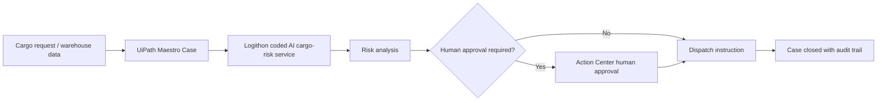

# Logithon CaseOps

**Human-approved cargo loading safety with UiPath Maestro.**

Logithon CaseOps is an AI cargo loading safety case orchestrator for UiPath AgentHack, Track 1: UiPath Maestro Case.

Core pitch:

> Logithon CaseOps uses UiPath Maestro Case to orchestrate cargo inspection, AI load-risk analysis, human supervisor approval, and dispatch instructions for safer, faster logistics operations.

This is not only an AI logistics dashboard. It is an enterprise workflow where UiPath Maestro Case is the orchestration and governance layer. AI agents assist with cargo analysis, while humans approve risky loading decisions before dispatch.

## What The Demo Shows

- A warehouse receives a cargo loading request.
- UiPath Maestro creates a case.
- The coded AI service analyzes cargo list data and uploaded or mock cargo evidence.
- The deterministic risk engine detects overload, imbalance, fragile stacking, missing evidence, damaged cargo, hazardous cargo, temperature-sensitive cargo, and low-confidence cases.
- Low-risk shipments are recommended for approval.
- High-risk or uncertain shipments are routed to a human supervisor.
- After approval, the system generates dispatch instructions and closes the case with an audit trail.

## Tech Stack

- Frontend: React + Vite
- Backend: Node.js + Express
- Risk engine: deterministic coded agent simulation
- Integration target: UiPath Maestro Case and UiPath API Workflows

## Quick Start

```bash
npm install
npm run dev
```

Open the dashboard:

```text
http://localhost:5173
```

The API runs at:

```text
http://localhost:4000
```

Run the deterministic risk-engine checks:

```bash
npm test
```

Build the frontend:

```bash
npm run build
```

## Sample Cases

The app includes three hackathon-ready cases:

| Case | Scenario | Result |
| --- | --- | --- |
| LCOPS-1001 | Low-risk normal cargo case | Recommended for dispatch |
| LCOPS-1002 | High-risk imbalance case | Routed to human approval |
| LCOPS-1003 | Fragile item stacking risk case | Approved with conditions |

Each case includes cargo details, AI analysis output, detected risks, confidence score, recommended action, human approval decision, final status, and audit timeline.

## API Endpoints

UiPath Maestro Case or UiPath API Workflows can call these endpoints.

| Method | Endpoint | Purpose |
| --- | --- | --- |
| GET | `/health` | Service health check |
| GET | `/api/cases` | List all sample cases |
| GET | `/api/cases/{case_id}` | Get a single case |
| POST | `/api/analyze-cargo` | Run cargo vision and metadata analysis |
| POST | `/api/risk-score` | Return structured risk score |
| POST | `/api/human-decision` | Record supervisor approval decision |
| POST | `/api/dispatch-instructions` | Generate dispatch instruction |
| POST | `/api/uipath/case-created` | Register a Maestro-created case |
| POST | `/api/uipath/stage-update` | Sync Maestro stage changes |

## UiPath Maestro Case Integration Guide

Recommended Maestro Case stages:

1. Shipment Intake
2. Cargo Vision Review
3. Load Risk Analysis
4. Human Supervisor Approval
5. Dispatch Instruction
6. Closed

Recommended workflow:

1. When a case is created, call `POST /api/uipath/case-created`.
2. During AI review, call `POST /api/analyze-cargo`.
3. During risk scoring, call `POST /api/risk-score`.
4. If review is required, route to Action Center or human supervisor approval.
5. When human approval is completed, call `POST /api/human-decision`.
6. Before closing the case, call `POST /api/dispatch-instructions`.
7. Sync final status with `POST /api/uipath/stage-update`.

## Architecture



## Sample Request And Response JSON

### Case Created

`POST /api/uipath/case-created`

Request:

```json
{
  "case_id": "LCOPS-1002",
  "uipath_case_id": "MAESTRO-CASE-2088",
  "shipment_id": "SHP-LAX-2088",
  "stage": "Shipment Intake"
}
```

Response:

```json
{
  "case_id": "LCOPS-1002",
  "shipment_id": "SHP-LAX-2088",
  "stage": "Shipment Intake",
  "risk_score": 94,
  "risk_level": "High",
  "requires_human_review": true,
  "approval_status": "Pending supervisor",
  "audit_events": []
}
```

### Analyze Cargo

`POST /api/analyze-cargo`

Request:

```json
{
  "case_id": "LCOPS-1002"
}
```

Response:

```json
{
  "case_id": "LCOPS-1002",
  "shipment_id": "SHP-LAX-2088",
  "stage": "Load Risk Analysis",
  "risk_score": 94,
  "risk_level": "High",
  "detected_issues": [
    {
      "id": "near_capacity",
      "severity": "Medium",
      "title": "Truck is loaded above 90 percent of rated capacity"
    },
    {
      "id": "weight_imbalance",
      "severity": "High",
      "title": "Weight distribution is outside safe balance tolerance"
    }
  ],
  "confidence_score": 0.96,
  "recommended_action": "Hold dispatch and request supervisor approval with a safer loading plan.",
  "requires_human_review": true
}
```

### Risk Score

`POST /api/risk-score`

Request:

```json
{
  "case_id": "LCOPS-1003"
}
```

Response:

```json
{
  "case_id": "LCOPS-1003",
  "shipment_id": "SHP-SEA-7731",
  "stage": "Load Risk Analysis",
  "risk_score": 100,
  "risk_level": "High",
  "confidence_score": 0.6,
  "requires_human_review": true,
  "why_human_approval_required": [
    "Fragile cargo is stacked below heavy freight",
    "Cargo image or loading evidence is missing",
    "Damaged cargo detected in shipment metadata",
    "Hazardous cargo requires governed approval",
    "Temperature-sensitive cargo requires handling confirmation"
  ]
}
```

### Human Decision

`POST /api/human-decision`

Request:

```json
{
  "case_id": "LCOPS-1002",
  "decision": "approved_with_conditions",
  "supervisor": "Action Center Supervisor",
  "notes": "Approved after rebalancing dense pallets toward the center line.",
  "safer_loading_plan": [
    "Move two pump pallets from left wall to center bay.",
    "Capture dock photo and axle-weight confirmation before seal."
  ]
}
```

Response:

```json
{
  "case_id": "LCOPS-1002",
  "shipment_id": "SHP-LAX-2088",
  "stage": "Dispatch Instruction",
  "approval_status": "Approved with conditions",
  "human_approval_decision": "Approved after rebalancing dense pallets toward the center line.",
  "safer_loading_plan": [
    "Move two pump pallets from left wall to center bay.",
    "Capture dock photo and axle-weight confirmation before seal."
  ]
}
```

### Dispatch Instructions

`POST /api/dispatch-instructions`

Request:

```json
{
  "case_id": "LCOPS-1002"
}
```

Response:

```json
{
  "instruction_id": "DISP-LCOPS-1002-12345",
  "case_id": "LCOPS-1002",
  "shipment_id": "SHP-LAX-2088",
  "final_decision": "Dispatch approved with safer loading plan",
  "dispatch_instruction": "Dispatch may proceed after the listed loading controls are confirmed and attached to the audit trail.",
  "loading_controls": [
    "Rebalance the heaviest pallets toward the center and forward third.",
    "Confirm cargo securement, seal number, driver acknowledgement, and departure timestamp."
  ],
  "close_case": true
}
```

### Stage Update

`POST /api/uipath/stage-update`

Request:

```json
{
  "case_id": "LCOPS-1002",
  "stage": "Closed",
  "status": "Complete"
}
```

Response:

```json
{
  "case_id": "LCOPS-1002",
  "stage": "Closed",
  "current_stage": "Closed",
  "approval_status": "Approved with conditions",
  "final_dispatch_decision": "Dispatch approved with safer loading plan"
}
```

## Deterministic AI Agent Simulation

The coded cargo-risk service simulates an AI agent with transparent rules:

- If total weight exceeds truck capacity, risk is high.
- If total weight is above 90 percent of truck capacity, risk is medium.
- If fragile items are stacked under heavy items, risk is high.
- If weight distribution is left/right or front/rear unbalanced, risk is medium or high.
- If cargo image or evidence is missing, risk is medium.
- If damaged cargo is detected in metadata, risk is high.
- If hazardous cargo is present, require human review.
- If temperature-sensitive cargo is present, require human review.
- If confidence is low, require human review.

The service returns detected risks, confidence score, risk level, recommendation, human-review reasons, and safer loading suggestions.

## Use Of Coding Agents

Codex was used to build:

- The coded cargo risk analysis service
- API endpoints
- Frontend dashboard
- Mock logistics data
- UiPath integration documentation
- Demo script

Codex builds specialized coded agents and services. UiPath Maestro remains the enterprise orchestration and governance layer.

## 5-Minute Demo Script

Use the dashboard button labeled `Run Demo Scenario`.

1. Introduce Logithon CaseOps as human-approved cargo loading safety orchestrated by UiPath Maestro Case.
2. Select `LCOPS-1002`, the high-risk imbalance case.
3. Run the demo scenario.
4. Narrate the stage movement: shipment intake, Maestro case creation, cargo analysis, risk scoring, human approval, dispatch instruction, case closure.
5. Show that the coded agent detects risk, but the supervisor approves the safer loading plan.
6. Close on the audit trail and API contract for UiPath workflows.

## Project Structure

```text
backend/
  data/cases.js              Sample cargo cases
  riskEngine.js              Deterministic coded cargo-risk service
  server.js                  Express API for UiPath and dashboard
  tests/riskEngine.test.js   Rule checks
src/
  App.jsx                    React command-center dashboard
  main.jsx                   React entrypoint
  styles.css                 Dark enterprise UI
docs/
  demo-script.md             Hackathon demo narration
```
